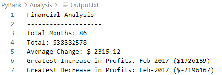
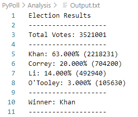

# PyBank and PyPoll Analysis
## Files in the Repository
The Repository contains two main folders that house the python scripts, resources, and output for each analysis.

* [PyBank](./PyBank) 

* [PyPoll](./PyPoll)

Each folder contains the script, a Resources folder containing the csv file, and an Analysis folder containing the text file that the script produces. The folder also contains a screenshot of the output the user should receive.

## Using the Scripts
Run in your choice of terminal - VS Code, Git Bash, etc. 

## Output
Both scripts will output text files containing results into the Analysis subfolder of the respective project.

### PyBank Results

The PyBank analysis includes: 

* The total number of months included in the dataset

* The net total amount of "Profit/Losses" over the entire period

* Calculate the changes in "Profit/Losses" over the entire period, then find the average of those changes

* The greatest increase in profits (date and amount) over the entire period

* The greatest decrease in losses (date and amount) over the entire period

### PyPoll Results

The PyPoll analysis includes: 
 
* The total number of votes cast

* A complete list of candidates who received votes

* The percentage of votes each candidate won

* The total number of votes each candidate won

* The winner of the election based on popular vote.

## Status
_finished_

## Inspiration
This project was assigned as part of the UTSA Data BootCamp.